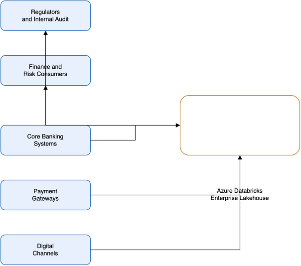
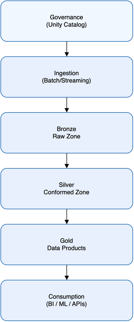
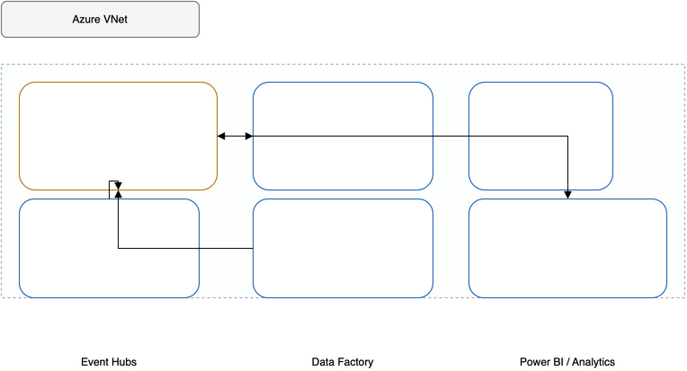
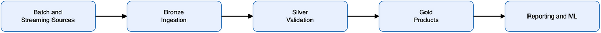

# Reference Architecture

Control reference: aligned to `finbricks_blog/docs/artifacts/templates/04-reference-architecture-template.md`.

## 1. Purpose

Define the target architecture pattern, control boundaries, and implementation standards for the fraud detection lakehouse on Azure Databricks.

## 2. Architecture views

### 2.1 Context view

Describe upstream/downstream ecosystems and control boundaries.

- Core actors: fraud operations, risk analytics, finance reporting, platform operations, security and compliance.
- Core systems: core banking platforms, card and payment platforms, digital channels, Azure Databricks, ADLS Gen2, Unity Catalog, downstream BI/analytics consumers.
- Trust boundaries: source systems boundary, cloud landing zone boundary, Databricks workspace boundary, data governance boundary for Bronze/Silver/Gold products.

### 2.2 Logical view

| Component | Responsibility | Owner | Critical dependencies |
|---|---|---|---|
| Source ingestion (batch + stream) | Capture transactional events and land raw records in Bronze | Data engineering | Upstream source availability, Event Hubs/batch schedules |
| Bronze processing | Preserve source-fidelity records with metadata and ingestion controls | Data engineering | ADLS storage, ingestion contracts |
| Silver conformance | Standardize schemas, deduplicate, enforce quality rules | Data engineering + governance | Quality rules, reference data |
| Gold data products | Publish contract-grade fraud and risk datasets for consumers | Data product owners | Approved data contracts, access controls |
| Unity Catalog governance | Enforce access policy, lineage, and classification controls | Data governance | Entra ID groups, catalog/schema policy model |
| Observability layer | Collect metrics, logs, alerts, and pipeline health signals | Platform operations | Azure Monitor/Log Analytics |

### 2.3 Deployment view

| Environment | Region | Isolation model | Change path |
|---|---|---|---|
| Dev | Azure primary region (non-prod landing zone) | Isolated workspace and storage accounts with non-prod controls | CI deploy via Databricks Asset Bundles + Terraform plan/apply |
| Test | Azure primary region (pre-prod landing zone) | Isolated workspace and storage accounts with controlled test data | Promotion from dev via approved CI/CD gates |
| Prod | Azure primary region (regulated production landing zone) | Fully isolated workspace, storage, networking, and secrets boundaries | Approved promotion from test with change control and evidence capture |

### 2.4 Data flow view

- Ingestion -> processing -> serving path: source systems feed Bronze, conformance in Silver, and curated fraud data products in Gold.
- Control points at each stage: ingestion validation, conformance and quality checks, access and lineage controls through Unity Catalog, and release controls through CI/CD.
- Failure handling path: retry and checkpointing for stream jobs, quarantine/reprocess patterns for bad records, and incident triage through runbook-led operations.

## 3. Integration patterns

| Pattern | Use case | Control requirement | Notes |
|---|---|---|---|
| Batch ingestion | Legacy core systems and scheduled extracts | Deterministic schedules, schema validation, auditable load logs | Supports sources that cannot guarantee event streams |
| Streaming ingestion | High-priority fraud signals from payment/card channels | Checkpointing, replay controls, latency SLOs, monitored failure paths | Provides faster detection for event-capable systems |

## 4. Security and control boundaries

- Identity boundary: Azure Entra ID for human and service identity with group-based authorization.
- Network boundary: VNet-injected Databricks with private endpoints and restricted traffic via NSGs.
- Policy enforcement boundary: Unity Catalog policies for least privilege, masking, and lineage-backed accountability.
- Administrative boundary: separation of platform admin, data engineering, and consumer roles with controlled elevation paths.

## 5. NFR alignment

| NFR area | Design choice | Target |
|---|---|---|
| Availability | Auto-scaling compute, resilient orchestration, and monitored jobs | Meet critical fraud pipeline availability SLOs per operating model |
| Recovery | Checkpointing/retries for streaming and controlled replay/reprocessing paths | Recover critical pipelines within agreed RTO/RPO targets |
| Performance | Delta optimization, partitioning, and workload-specific compute sizing | Sustain near-real-time and daily reporting SLAs |
| Auditability | Unity Catalog lineage, access controls, and evidence-oriented deployment flow | Produce review-ready traceability for regulatory and internal audit |

## 6. Failure modes and design safeguards

| Failure mode | Likely cause | Safeguard | Owner |
|---|---|---|---|
| Late or missing source feeds | Upstream outage or schedule drift | Data freshness alerts, backfill/replay process, escalation runbook | Data engineering + source system owners |
| Streaming pipeline interruption | Event infrastructure issue or job failure | Durable checkpoints, automatic retries, and manual replay procedures | Platform operations |
| Unauthorized access attempt | Misconfigured role/group grants | Unity Catalog least-privilege model, periodic access reviews, approval workflow | Governance + security |
| Data quality regression in Gold products | Schema drift or upstream semantic change | Contract checks, quality gates in Silver, release approval gates | Data product owners |

## 7. Decision traceability

Major architecture choices are justified in ADRs:

- ADR-001: Platform Selection (Azure Databricks Lakehouse) - `05-architecture-decision-records.md`
- ADR-002: Streaming vs Batch Ingestion (Hybrid) - `05-architecture-decision-records.md`
- ADR-003: Security and Governance Model - `05-architecture-decision-records.md`

## 8. Review checklist

- Control boundaries are technically enforceable through identity, network, and policy controls.
- Architecture supports additional AI/ML workloads through governed compute and data product patterns.
- Dependencies and ownership are explicit across ingestion, governance, and operations.
- Production deployment path is auditable and defensible for risk and architecture review.
